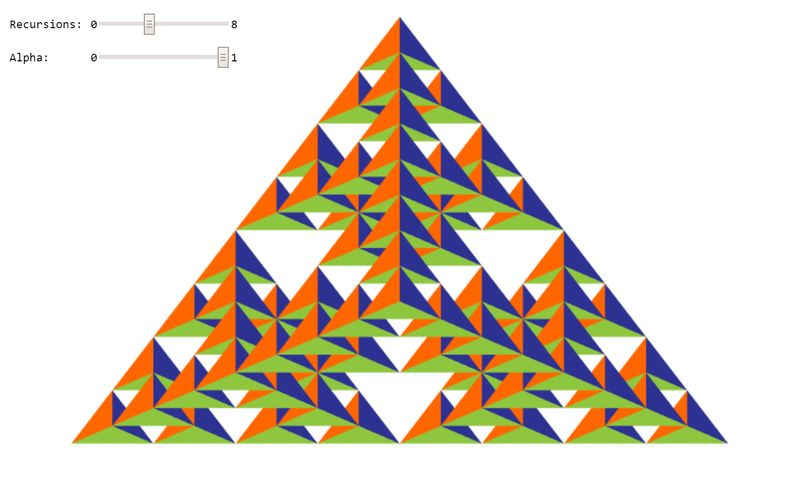
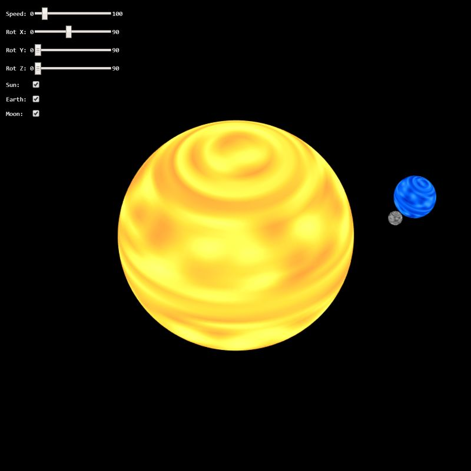
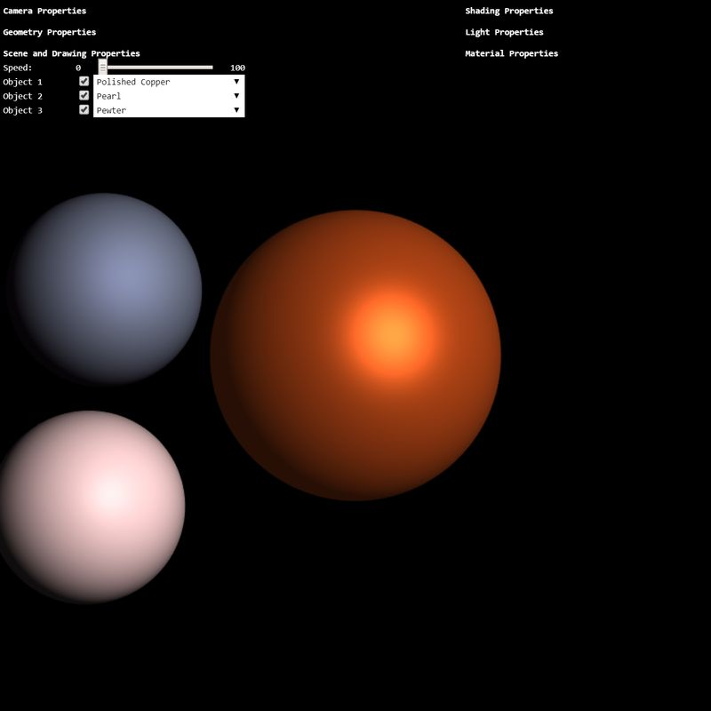
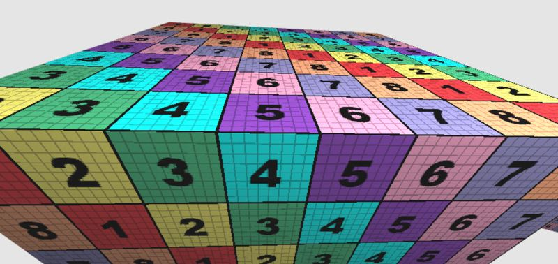
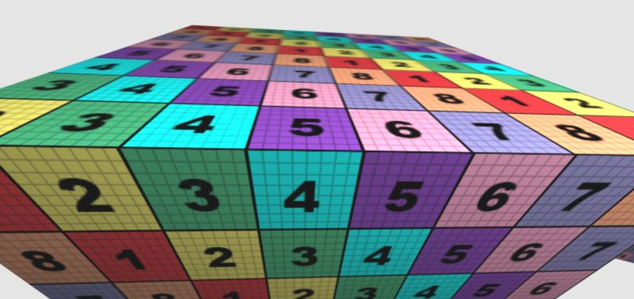
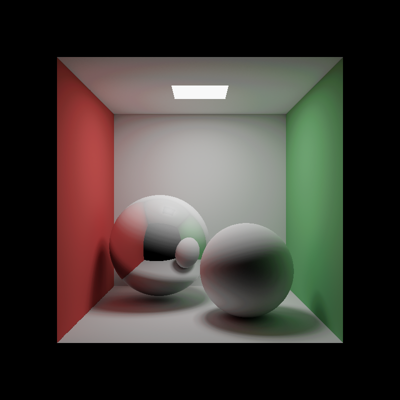

# CS 438 — Interactive Computer Graphics @ NJIT

An intro to core computer graphics concepts: GPU rendering pipeline · 2D/3D drawing · lighting & shading · rasterization · geometric transformations · curves & surfaces · subdivision · meshing · and more.

WebGPU assignments from the course — everything runs in the browser, no installs, no build step, just open an HTML file.

---

## Assignments

### A1 — WebGPU Basics
`A1/a1_student/`

First time touching WebGPU. Built four classic graphics demos:
- **Task 1** — 2D Sierpinski gasket via recursive triangle subdivision
- **Task 2** — Circle approximation using polygon fan geometry
- **Task 3** — 3D Sierpinski tetrahedron
- **Task 4** — Procedural UV sphere + solar system animation

The big thing I learned here was how data actually travels from CPU to GPU: you pack geometry into vertex buffers, describe a render pipeline, set up bind groups, then fire off a draw call. JavaScript sets everything up; WGSL shaders run on the GPU in parallel for every vertex and fragment. Once that mental model clicked, everything else made more sense.

| | |
|---|---|
|  |  |

---

### A2 — Phong Lighting
`A2/a2_student/`

Got into lighting. Implemented the Phong model (ambient + diffuse + specular) on 3D meshes with interactive controls for moving lights around. Learned why the dot product between a surface normal and the light direction gives you that soft gradient, and how the specular highlight works using the reflection vector. Also played with Blinn-Phong, which swaps the reflection vector for a halfway vector — cheaper to compute and honestly looks just as good.

---

### A3 — Texture & Normal Mapping
`A3/a3_student/`

Built on A2 by replacing flat colors with actual images (texture mapping) and then faking surface detail using normal maps. The texture sampling part was straightforward — UV coordinates per vertex, interpolate across the triangle, sample the image in the fragment shader. Normal mapping was harder. To make bump detail look correct from any angle, you need to compute a tangent space for every triangle, which means generating tangent and bitangent vectors from the UVs. More math than expected, but the visual difference between a flat mesh and a normal-mapped one is pretty striking.

| Without normal map | With normal map |
|---|---|
|  |  |

---

### A4 — Cornell-Box Ray Tracer (WebGPU Compute)
`A4/`

Moved from rasterization to ray tracing. The renderer runs entirely in a WebGPU compute shader — no raster pipeline, just a compute pass that writes radiance to an `rgba16float` storage texture, then a fullscreen blit that tone-maps and gamma-corrects onto the canvas. Scene is a PBRT-style Cornell box with five walls, a ceiling area light, a diffuse sphere, and a metal sphere.

- **Task 2b** — Sphere intersection: solved the simplified quadratic `t² + 2bt + c = 0` (valid when `|rayDir| = 1`), picking the nearest root in front of the ray
- **Task 3** — Lambert + Phong direct shading: same model as A2/A3, evaluated once per hit against a direct light sample from NEE
- **Task 4** — Metal reflection: branched on a per-primitive metal flag — diffuse surfaces scatter via `normalize(N + randomInUnitSphere())`, metal surfaces reflect via WGSL's `reflect()` builtin

The framework ships with next-event estimation (NEE) and multi-frame progressive accumulation. NEE sends a shadow ray to the area light at every non-emissive hit, dramatically cutting variance. Accumulation blends each frame into a running average so indirect noise integrates to clean. Toggling NEE off reveals how dark and noisy an enclosed Cornell box is when the only way to collect light is for a random bounce to accidentally hit the small ceiling emitter.

---

## Stack

- **WebGPU** — browser-native GPU API (no WebGL)
- **WGSL** — WebGPU Shading Language for vertex + fragment shaders
- Vanilla JS, no frameworks

## Running

Open any `index.html` in a browser with WebGPU support (Chrome 113+ works). Each assignment is self-contained in its subfolder.
